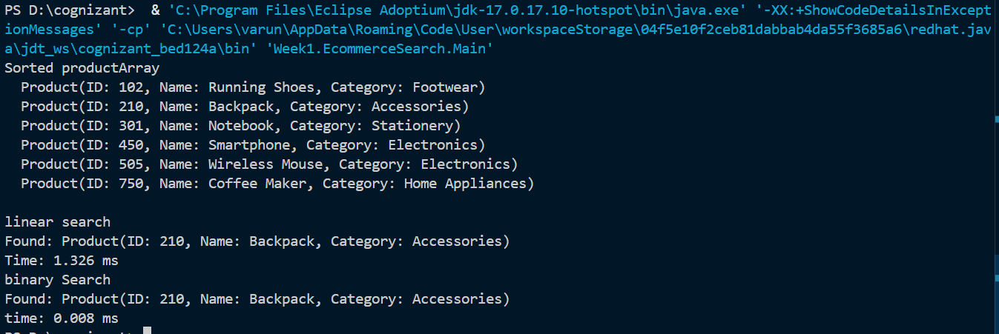

# E-commerce Platform Search Function

## Note

This README was originally written by me. I used AI assistance only to improve the formatting and convert the content into a more readable Markdown document. The implementation, understanding, and explanation of the project are my own. AI was also used to generate a sample product list when I couldn't decide on the data and to fix my typing mistakes.

---

## Problem Statement

The given problem was:

> You are working on the search functionality of an e-commerce platform. The search needs to be optimized for fast performance.

### Steps

1. **Understand Asymptotic Notation** – Explain Big O notation and analyze best, average, and worst-case scenarios for search operations.
2. **Setup** – Create a `Product` class with attributes like `productId`, `productName`, and `category`.
3. **Implementation** – Implement Linear Search and Binary Search algorithms. Store products in an array for linear search and a sorted array for binary search.
4. **Analysis** – Compare the time complexity of both algorithms and discuss which is more suitable for the platform.

---

## Project Setup

I created a Java project inside the package `Week1.EcommerceSearch` and added a single Java file named **`Product.java`**.

Since Java allows only one `public` class per file, I made `Product` the public class (matching the filename) and added the `SearchAlgorithms` and `Main` classes with default (package-private) access in the same file.

---

## Implementation

### 1. The `Product` Class

I created a simple POJO (Plain Old Java Object - this was something new to me, apparently this convention means the class does not implements or extends any heavy framework like servlet or threads. Eventhough it implements comparable, it is a in built interface and comparable is implemented even in String, well this is a self contained feature rather than a external utility) with three attributes:
- `productId` (int)
- `productName` (String)
- `category` (String)

I added a constructor, getters, and overrode `toString()` to display the product details cleanly.

To enable sorting for Binary Search, I implemented the `Comparable<Product>` interface and overrode the `compareTo()` method to sort products by their `productId`. This allowed me to use `Arrays.sort()` directly without passing an extra comparator.

```java
@Override
public int compareTo(Product other) {
    return Integer.compare(this.productId, other.productId);
}
```

### 2. The `SearchAlgorithms` Class

I implemented two static search methods:

- **`linearSearch()`** – Iterates through the array sequentially. Works on unsorted data.
- **`binarySearch()`** – Uses the divide-and-conquer approach. Requires a sorted array.

### 3. The `Main` Class (Testing)

In the `main()` method, I:
1. Created an unsorted array of 6 products (I used AI to generate this list because I couldn't decide on the sample data myself).
2. Cloned the array and sorted it using `Arrays.sort()` (which uses my `compareTo` implementation).
3. Performed both searches for a target product ID (`210`).
4. Measured the execution time using `System.nanoTime()` to compare performance.

---

## Struggles Faced

### 1. Deciding Between `Comparable` and `Comparator`

Initially, I wasn't sure which approach to take for sorting. Using `Comparator` would have allowed me to keep the `Product` class completely clean, but it would require passing a comparator to `Arrays.sort()` every time. Since I only needed to sort by `productId` and the exercise didn't require multiple sorting strategies, I decided to implement `Comparable`. It made the code concise and the `Arrays.sort(sortedArray);` call work seamlessly.

### 2. The Biggest Hurdle: `IllegalFormatConversionException`

When I tried to print the execution time, I ran into a frustrating error:

```
Exception in thread "main" java.util.IllegalFormatConversionException: f != java.lang.Long
```

I was using `System.out.printf("Time: %.3f ms\n", (end - start));` but `end - start` returns a `long` (nanoseconds), while `%f` expects a floating-point number.

**My initial fix attempt** was to divide by `1_000_000`:
```java
System.out.printf("Time: %.3f ms\n", (end - start) / 1_000_000);
```
But this still resulted in a `long` because `long / int` = `long`. Java was still complaining.

**The real solution** was to divide by `1_000_000.0` (a double literal), which promotes the result to a `double`:
```java
System.out.printf("Time: %.3f ms\n", (end - start) / 1_000_000.0);
```
This fixed the error and correctly displayed the time in milliseconds. In my final code, I added a comment explaining this realization.

### 3. Understanding Nanoseconds vs Milliseconds

I initially thought that printing nanoseconds directly might be okay, but the numbers are huge and unreadable. Converting to milliseconds made the output much clearer for performance analysis.

---

## What I Did Later (Fixes & Improvements)

After struggling with the formatting error, I:

1. **Fixed the time conversion** – Added `/ 1_000_000.0` to both `printf` statements to properly convert nanoseconds to milliseconds and satisfy the `%f` format specifier.
2. **Added a comment** in the code to remind myself (and future readers) why the conversion is necessary.
3. **Kept the implementation simple** – Since the exercise focuses on search algorithms rather than concurrent programming, I didn't overcomplicate the `Product` class with unnecessary features.
4. **Tested with a valid target** – Searched for product ID `210` to verify both algorithms returned the correct product.

---

## Analysis

| Algorithm | Time Complexity | Data Requirement |
| :--- | :--- | :--- |
| **Linear Search** | O(n) – scans every element in the worst case | Works on unsorted data |
| **Binary Search** | O(log n) – halves the search space each iteration | Requires sorted data |

For an e-commerce platform with thousands (or millions) of products, **Binary Search is far more suitable**. It provides lightning-fast lookups with minimal comparisons. However, in a real-world production environment, I would use a `HashMap` for O(1) ID lookups or a search engine like Elasticsearch for text-based searches. But within the scope of this assignment, Binary Search is the clear winner.

---

## Output

Below is a screenshot of the program output:

