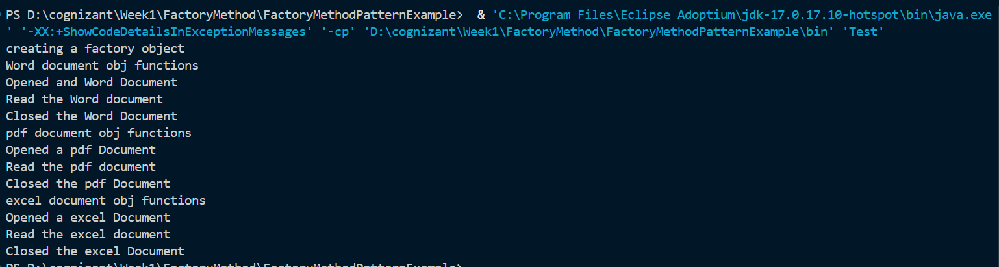

Here is the README for your **Factory Method Pattern** project, written exactly in the same style and structure as your Singleton README. It incorporates the struggles you faced (the Medium article confusion, the "where do I use this?" question) and how you resolved them.

---

# Factory Method Pattern Example

## Note

This README was originally written by me. I used AI assistance only to improve the formatting and convert the content into a more readable Markdown document. The implementation, understanding, and explanation of the project are my own.

---

## Problem Statement

The given problem was:

> You are developing a document management system that needs to create different types of documents (e.g., Word, PDF, Excel). Use the Factory Method Pattern to achieve this.

### Steps

1. Create a new Java project named **FactoryMethodPatternExample**.
2. Define Document Classes:
   - Create interfaces or abstract classes for different document types such as `WordDocument`, `PdfDocument`, and `ExcelDocument`.
3. Create Concrete Document Classes:
   - Implement concrete classes for each document type that implements or extends the above interfaces or abstract classes.
4. Implement the Factory Method:
   - Create an abstract class `DocumentFactory` with a method `createDocument()`.
   - Create concrete factory classes for each document type that extends `DocumentFactory` and implements the `createDocument()` method.
5. Test the Factory Method Implementation:
   - Create a test class to demonstrate the creation of different document types using the factory method.

---

## Project Setup

I created a Java project in Visual Studio Code and organized the files into packages to keep the structure clean and modular:

- **`documents` package**: Contains the `Document` interface and the concrete document classes (`WordDocument`, `PdfDocument`, `ExcelDocument`).
- **`factories` package**: Contains the abstract `DocumentFactory` class and the concrete factory classes (`WordDocumentFactory`, `PdfDocumentFactory`, `ExcelDocumentFactory`).
- **Root directory (`src`)**: Contains the `Test.java` file which acts as the client.

---

## Implementation

According to the given requirements, I first defined the `Document` interface with the methods `open()`, `read()`, and `close()`. All concrete document classes implement this interface, ensuring that they provide specific behavior for these methods.

Next, I created the abstract class `DocumentFactory` which declares the factory method `createDocument()` that returns a `Document` object. I then created three concrete factory classes—one for each document type. Each factory overrides the `createDocument()` method to instantiate and return its corresponding document object.

In `Test.java`, the client code instantiates a specific concrete factory (e.g., `new WordDocumentFactory()`) and calls the `createDocument()` method to obtain the document object. The client then works with the document using the `Document` interface methods.

---

## Understanding the Factory Method Pattern

The Factory Method pattern defines an interface for creating an object but lets subclasses decide which class to instantiate. This promotes loose coupling by moving the creation logic out of the client code and into specific factory subclasses.

Key benefits of this approach:

- **Open/Closed Principle**: New document types can be added by creating new document classes and corresponding factory classes, without modifying any existing code.
- **Decoupling**: The client code depends only on the `Document` interface and the abstract `DocumentFactory`, not on the concrete document classes.
- **Single Responsibility**: Each factory is responsible solely for creating its specific document type.

---

## Struggles and Thought Process

When I first looked at this exercise, I found it confusing because of the sheer number of interfaces, abstract classes, and concrete classes. I initially referred to a Medium article that explained a simpler version of a Factory pattern, where a single `VehicleFactory` class used a `String` parameter to decide which vehicle to create (using `if-else` statements).

This led to a major struggle: **I could not understand why this exercise required separate factories for each document type.**

I asked myself:

1. *"Why can't I just have one `DocumentFactory` that takes a `String` parameter like the article?"*
2. *"Where do I actually use the `WordDocumentFactory`? Do I need another factory class to choose between them?"*

After carefully revisiting the requirements and the definition of the *Gang of Four* (the other name for the set of design patterns given, apparently) Factory Method pattern, I realized the key difference:

- The **Simple Factory** (from the article) centralizes the creation logic inside one class, but violates the Open/Closed Principle because adding a new type requires modifying that single class.
- The **Factory Method Pattern** (this exercise) pushes the creation decision to subclasses. The client chooses which factory to instantiate directly.

I also realized that I **do not** need a separate "factory selector" class. The `Test.java` client itself acts as the selector. If I wanted to make it dynamic based on user input, I could simply place an `if-else` or `switch` statement inside the `main()` method to choose the factory, without creating an additional wrapper class.

---

## Why the Current Implementation Was Kept

The exercise explicitly requested the Factory Method Pattern to demonstrate polymorphism and adherence to the Open/Closed Principle. Therefore, I implemented separate concrete factories for each document type.

Even though it introduces more classes, this approach makes the system highly extensible. If a new document type (e.g., `PowerPointDocument`) needs to be added in the future, I would only need to create `PowerPointDocument.java` and `PowerPointDocumentFactory.java` without touching any of the existing factory or document classes.

For the purpose of this assignment, the implementation was kept straightforward to clearly illustrate the structure of the Factory Method pattern and how the client interacts with different concrete factories.

---

## Output

Running the `Test.java` class produces the following output:

