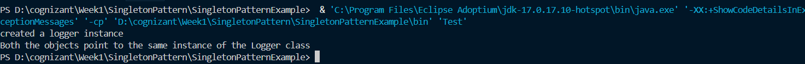

# Singleton Pattern Example


## Note

This README was originally written by me. I used AI assistance only to improve the formatting and convert the content into a more readable Markdown document. The implementation, understanding, and explanation of the project are my own.

---

## Problem Statement

The given problem was:

> You need to ensure that a logging utility class in your application has only one instance throughout the application lifecycle to ensure consistent logging.

### Steps

1. Create a new Java project named **SingletonPatternExample**.
2. Define a Singleton class:

   * Create a class named `Logger` that has a private static instance of itself.
   * Ensure the constructor of `Logger` is private.
   * Provide a public static method to get the instance of the `Logger` class.
3. Implement the Singleton Pattern.
4. Test the implementation to verify that only one instance of `Logger` is created and used throughout the application.

---

## Project Setup

I created a Java project in Visual Studio Code and added two Java files:

* `Logger.java`
* `Test.java`

---

## Implementation

According to the given requirements, I made the constructor of the `Logger` class private.

This prevents other classes from creating new instances of the `Logger` class using the `new` keyword. As a result, the `getInstance()` method becomes the only way to obtain an object of the `Logger` class.

In `Test.java`, the `getInstance()` method is used to retrieve the logger object and verify that the same instance is returned every time.

---

## Understanding the Singleton Pattern

The Singleton pattern ensures that:

* Only one instance of a class exists.
* The instance can be accessed globally.
* Object creation is controlled by the class itself.

The private constructor prevents external instantiation, while the static instance and `getInstance()` method provide controlled access to the object.

---

## Thread Safety Consideration

From the provided study materials, I learned that the current implementation is **not thread-safe**.

If multiple threads access the `getInstance()` method simultaneously, there is a possibility that more than one instance could be created.

Two common approaches can be used to solve this issue:

### 1. Synchronized Method

```java
public static synchronized Logger getInstance() {
    ...
}
```

This approach ensures thread safety but introduces additional overhead because every call to the method must acquire a lock.

### 2. Bill Pugh Singleton Pattern

Another approach is to use a private static holder class.

```java
private static class LoggerHolder {
    private static final Logger INSTANCE = new Logger();
}
```

This method provides thread safety automatically through class loading mechanisms and avoids synchronization overhead. This approach is commonly known as the **Bill Pugh Singleton Pattern**.

---

## Why the Current Implementation Was Kept

For this project, only a single class accesses the logger object. Since there is no concurrent access, the basic Singleton implementation is sufficient for the given requirements.

Therefore, the implementation was intentionally kept simple.

---

## Output


